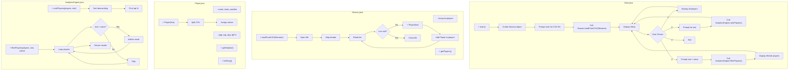

```mermaid

flowchart TD

%% ========================
%% MAIN CLASS
%% ========================

subgraph Main.java
    M1["+ main()"]
    M1 --> M2["Create Season object"]
    M2 --> M3["Prompt user for CSV file"]
    M3 --> M4["Call Season.loadFromCSV(filename)"]

    M4 --> M5["Display Menu"]

    M5 --> M6{"User Choice"}

    M6 -- 1 --> M7["Display all players"]
    M7 --> M5

    M6 -- 2 --> M8["Prompt for stat"]
    M8 --> M9["Call AnalyticsEngine.rankPlayers()"]
    M9 --> M5

    M6 -- 3 --> M10["Prompt stat + value"]
    M10 --> M11["Call AnalyticsEngine.filterPlayers()"]
    M11 --> M12["Display filtered players"]
    M12 --> M5

    M6 -- 4 --> M13["Exit"]
end


%% ========================
%% SEASON CLASS
%% ========================

subgraph Season.java
    S0["- ArrayList<Player> players"]

    S1["+ loadFromCSV(filename)"]
    S1 --> S2["Open file"]
    S2 --> S3["Skip header"]
    S3 --> S4["Read line"]

    S4 --> S5{"Line null?"}

    S5 -- No --> S6["+ Player(line)"]
    S6 --> S7["Add Player to players"]
    S7 --> S4

    S5 -- Yes --> S8["Close file"]

    S9["+ getPlayers()"]
end


%% ========================
%% PLAYER CLASS
%% ========================

subgraph Player.java
    P0["- name, team, position"]
    P1["- ppg, rpg, apg, fgPct"]

    P2["+ Player(line)"]
    P2 --> P3["Split CSV"]
    P3 --> P4["Assign values"]

    P5["+ getStat(stat)"]
    P6["+ toString()"]
end


%% ========================
%% ANALYTICS ENGINE
%% ========================

subgraph AnalyticsEngine.java
    A1["+ rankPlayers(players, stat)"]
    A1 --> A2["Sort descending"]
    A2 --> A3["Print top N"]

    A4["+ filterPlayers(players, stat, value)"]
    A4 --> A5["Loop players"]

    A5 --> A6{"stat > value?"}
    A6 -- Yes --> A7["Add to result"]
    A6 -- No --> A8["Skip"]

    A7 --> A5
    A8 --> A5

    A5 --> A9["Return results"]
end
```
